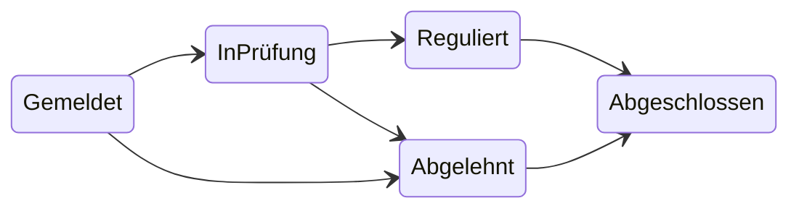

# Schadenverwaltung
Kleine Schadenverwaltung als ASP.NET Core Web API mit EF Core und PostgreSQL, Lern- und Portfolioprojekt.
Die Versicherungsdomäne ist generisch und frei erfunden.

## Stand
**Etappe 1 abgeschlossen:** Domänenmodell mit Fachregeln und Unit-Tests.
Web-API und Datenbank folgen in Etappe 2.

## Fachbegriffe
| Begriff | Im Code | Bedeutung |
|---|---|---|
| Vertrag | `Contract` | Versicherungsvertrag mit Sparte, Beginn und Status |
| Schaden | `Claim` | Gemeldeter Schadenfall zu einem Vertrag |
| Zahlung | `Payment` | Auszahlung auf einen Schaden |
| Reserve | `Reserve` | Erwarteter Gesamtaufwand für einen Schaden |

## Schadenstatus

Andere Wechsel lehnt der Schaden selbst ab.

## Umgesetzte Fachregeln
- **Gültige Objekte:** Verträge, Schäden und Zahlungen lassen sich nur mit gültigen Werten erzeugen.
- **Statusübergänge:** nur die Wechsel aus dem Diagramm oben.
- **Zahlungssperre:** keine Zahlung auf abgelehnte oder abgeschlossene Schäden.
- **Reservewarnung:** Übersteigen die Zahlungen die Reserve, wird trotzdem gebucht, das Ergebnis enthält aber eine Warnung.

## Technik
- .NET 10, C#
- xUnit für Unit-Tests
- Nullable Reference Types, Warnungen gelten als Fehler (`Directory.Build.props`)

## Projektstruktur
```
src/
  Schadenverwaltung.Api/             Web-API (folgt in Etappe 2)
  Schadenverwaltung.Domain/          Fachmodell und Regeln, ohne Abhängigkeiten
  Schadenverwaltung.Infrastructure/  Datenbankzugriff (folgt in Etappe 2)
tests/
  Schadenverwaltung.Tests/
```

## Bauen und testen
```bash
dotnet build
dotnet test
```
